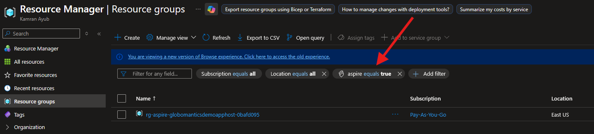
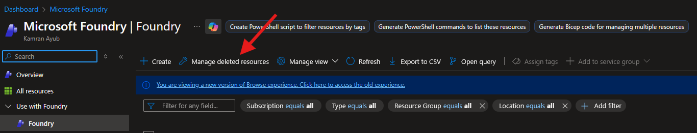

# Full Demo

This is the full course demo project. It uses [Aspire](https://aspire.dev), a cross-platform Infrastructure-as-Code (IaC) local development environment.

<!-- TOC depthfrom:2 -->

- [Prerequisites](#prerequisites)
- [Get Started](#get-started)
- [Using the MCP Inspector](#using-the-mcp-inspector)
- [Connecting to the MCP Server](#connecting-to-the-mcp-server)
    - [Visual Studio Code default](#visual-studio-code-default)
    - [Claude Desktop optional](#claude-desktop-optional)
    - [ChatGPT web only](#chatgpt-web-only)
- [Azure Provisioning optional](#azure-provisioning-optional)
    - [Configure Azure Integration for Aspire](#configure-azure-integration-for-aspire)
    - [Indexing the PDF Documents](#indexing-the-pdf-documents)
    - [Deleting and Cleaning Up Resources](#deleting-and-cleaning-up-resources)
    - [Troubleshooting](#troubleshooting)
        - [The access token is from the wrong issuer](#the-access-token-is-from-the-wrong-issuer)
        - [Authentication failed against tenant](#authentication-failed-against-tenant)
        - [hrm-search-service: Operation would exceed 'free' tier service quota.](#hrm-search-service-operation-would-exceed-free-tier-service-quota)
- [Protect the MCP Server with Entra ID optional](#protect-the-mcp-server-with-entra-id-optional)
    - [Enabling Authentication](#enabling-authentication)
    - [HRM API Entra App Registration](#hrm-api-entra-app-registration)
    - [MCP Server Entra App Registration](#mcp-server-entra-app-registration)
    - [Troubleshooting](#troubleshooting)
        - [The redirect URI specified in the request does not match](#the-redirect-uri-specified-in-the-request-does-not-match)
- [Preparing for the Deployment](#preparing-for-the-deployment)
- [Infrastructure](#infrastructure)
    - [Prerequisite: Entra Tenant Configuration](#prerequisite-entra-tenant-configuration)
        - [Configuring App Delegation / Impersonation](#configuring-app-delegation--impersonation)
    - [Provision HRM API](#provision-hrm-api)
        - [Upload PDF Documents](#upload-pdf-documents)
        - [Azure AI Search Configuration](#azure-ai-search-configuration)
    - [Provision MCP Server](#provision-mcp-server)
- [HRM API](#hrm-api)
    - [Overview](#overview)
    - [Authentication & identity](#authentication--identity)
    - [Data & persistence](#data--persistence)
    - [Notes](#notes)
- [MCP Server](#mcp-server)
- [Azure Blob Storage](#azure-blob-storage)
- [Azure AI Search](#azure-ai-search)

<!-- /TOC -->

## Prerequisites

- Follow the [Aspire](https://aspire.dev/get-started/prerequisites/) prerequisites guide
- [.NET 8 SDK](https://get.dot.net/8) and the [.NET 10 SDK](https://get.dot.net/10)
- [Azure Functions Core Tools](https://learn.microsoft.com/en-us/azure/azure-functions/functions-run-local)
- [Node.js 22+](https://nodejs.org)
- [Docker Desktop](https://www.docker.com/products/docker-desktop/) or [Podman](https://podman.io)
- _Optional:_ [Azure CLI](https://learn.microsoft.com/en-us/cli/azure/install-azure-cli?view=azure-cli-latest) for Azure integration
- _Recommended:_ [Visual Studio Code](https://code.visualstudio.com)

The Aspire CLI (`aspire`) must be installed and available on the path. You can install using the following scripts.

On Windows:

    iex "& { $(irm https://aspire.dev/install.ps1) }"

On Linux or macOS:

    curl -sSL https://aspire.dev/install.sh | bash

Run the following commands to verify your environment is set up correctly:

```sh
dotnet --list-sdks # Should include 8.x and 10.x
node -v # Should be 22.x or above
npm -v # Should be 10.x or above
aspire --version # Should be 13.1 or above
func -v # Should be 4.6.0 or above
```

## Get Started

In the demo directory, run Aspire:

```sh
aspire run
```

> [!IMPORTANT]
> If this is your first time running an Aspire project, the `aspire run` command will prompt you to **Trust certificates**. On Windows and macOS, you can follow the prompts. These are required for the local development environment to use HTTPS.

If everything is working, you will Aspire print out the service information like this:

```sh

     AppHost:  Globomantics.Demo.AppHost/Globomantics.Demo.AppHost.csproj                 
                                                                                          
   Dashboard:  https://localhost:17006/login?t=unique-code        
                                                                                          
        Logs:  /Users/kamranicus/.aspire/cli/logs/apphost-10541-2026-01-09-16-26-56.log   
                                                            
               Press CTRL+C to stop the apphost and exit. 
```

Follow the **Dashboard** link to view the Aspire dashboard and find your service URLs.

The following Aspire resources should be **Healthy**:

- `mcp` - MCP server project (C#) hosted by default at `http://localhost:5000`
- `mcp-inspector` - MCP inspector (npx) hosted by default at `http://localhost:6274`
- `mcp-patcher` - Fixes a known issue with MCP Inspector that makes it incompatible with Entra ID-based OAuth flows
- `hrm-api` - Azure Functions project hosted on `http://localhost:7040`
- `hrm-documents-storage` - Azure blob storage (with PDFs pre-baked)
- `funcstorage...` - Azure Functions project backing storage

## Using the MCP Inspector

Aspire has provisioned the MCP Inspector (`mcp-inspector`) resource. Click the **Client** link in the Dashboard to connect to your MCP server!

## Connecting to the MCP Server

In your AI tool MCP configuration, you can follow the guide in the course or in tool documentation. The URL should be `http://localhost:5000`, but you
can view the MCP server URL in the Aspire Dashboard (the `mcp` resource).

### Visual Studio Code (default)

In the `.vscode/mcp.json` configuration, the MCP server is already set up:

```json
{
    "servers": {
        "globomantics-mcp-server-local": {            
            "type": "http",
            "url": "http://localhost:5000/"
        }
    }
}
```

Just click the **Start** command over the MCP server name to start it. Reference the course or [VS Code documentation](https://code.visualstudio.com/docs/copilot/customization/mcp-servers) for how to use with Copilot Agent mode.

### Claude Desktop (optional)

In the course, Claude is used to demo the MCP server for STDIO and Streamable HTTP transport. With authentication disabled, you can configure the MCP server in `claude_desktop_config.json` (Settings -> Developer):

```json
{
    "mcpServers": {
        "globomantics-mcp-server-local": {            
            "type": "http",
            "url": "http://localhost:5000/"
        }
    }
}
```

This is shown step-by-step in the course or you can [reference this guide by MCPBundles](https://www.mcpbundles.com/blog/claude-desktop-mcp#claude-desktop-mcp-config-file-location).

### ChatGPT (web only)

In order to use MCP servers with ChatGPT, you need to enable [Developer Mode](https://platform.openai.com/docs/guides/developer-mode).

> [!IMPORTANT]
> This is only available on the **Web** and on paid plans.

This requires you to deploy your MCP server, which you can find how to in the [Deploying the Project](#deploying-the-project) section.

> [!IMPORTANT]
> `enableAuth` must be `false` in your Aspire project as Entra ID is only supported by Visual Studio Code's MCP integration. In the **Advanced** MCP course,
> we introduce an Auth Gateway that makes your OAuth-protected MCP server compatible with all MCP clients.

## Azure Provisioning (optional)

By default, Aspire will not provision any Azure infrastructure and authentication is disabled. This is the easiest way to run the course demos
but some MCP tools that require Azure authentication, like `ask_about_policy` will be disabled. The rest will work locally!

You can optionally enable Azure provisioning to try out Azure AI Search or deploy the entire project remotely to run on Azure.

### Configure Azure Integration for Aspire

The [Azure CLI](https://learn.microsoft.com/en-us/cli/azure/install-azure-cli?view=azure-cli-latest) is required for Azure integration in Aspire.

First, begin by logging into the Azure CLI:

```sh
az login
```

This will trigger a login flow and afterwards it will ask you to select your subscription. Choose the Azure subscription you want to deploy resources in and note its `SubscriptionId`.

> [!TIP]
> You can also query your subscription ID with `az account show --query id`

Then, add the following Azure subscription secrets:

```sh
dotnet user-secrets set "Azure:SubscriptionId" "your-subscription-id" --project ./Globomantics.Demo.AppHost
dotnet user-secrets set "Azure:Location" "eastus" --project ./Globomantics.Demo.AppHost
dotnet user-secrets set "Azure:CredentialSource" "AzureCli" --project ./Globomantics.Demo.AppHost
```

Now run Aspire:

```sh
aspire run
```

When provided an Azure subscription ID and an Entra tenant ID, Aspire will provision the following resources:

- `hrm-search-service` - Azure AI Search Service
- `hrm-foundry` - Azure AI Foundry
- `hrm-embeddings` - Foundry-deployed OpenAI model for text-embedding-ada-002

### Indexing the PDF Documents

The first time you run the Aspire project with Azure provisioning, an AI search index is created but the PDF documents will not actually be _indexed_ yet. If you try to run the `ask_about_policy` tool, you will not see any document excerpt until you index the PDF documents in the vector database.

To index the PDFs, in the Aspire dashboard, click the **Run Search Indexer** command button next to the `hrm-search-service` to index the documents.


It will take a few seconds before the indexing operation runs. You can view the logs using the Console Logs screen in the Dashboard, or
view the Search Indexer in the Azure portal for details.

> [!NOTE]
> This operation will cost a few cents as it issues requests to the embedding model deployment to index the documents.

### Deleting and Cleaning Up Resources

Aspire does not automatically teardown your provisioned Azure resources. While every effort has been made to use the Free SKUs for each resource,
there may still be costs associated with keeping the resources provisioned.

To delete the resources Aspire provisions, find the resource group name:

**Using the .NET User Secrets Tool**

```sh
dotnet user-secrets list --project Globomantics.Demo.AppHost/Globomantics.Demo.AppHost.csproj
```

The resource group name is stored in the `Azure:ResourceGroup` secret.

**Using the Azure Portal**

Under Resource Groups, add a **Filter** for the tag `aspire` with a value of `true`.



Once you find the resource group, delete it using the Azure CLI (or Azure Portal):

```sh
az group delete --name <RESOURCE_GROUP_NAME> --yes --no-wait
```

> [!IMPORTANT]
> The Azure AI Foundry resource will only be _soft-deleted._ Azure keeps it around for a few days before purging it.

If you want to purge it right away, in the Azure Portal navigate to the AI Foundry resources overview and in the quick action toolbar, select "Manage Deleted Resources":



Select the Foundry resource, and click "Purge." This will have to be done before `aspire run` will provision a Foundry resource again!

> [!CAUTION]
> If you delete the Azure resource group, `aspire run` will not re-provision resources automatically but they will still appear "Healthy." You will need to **clear the user secrets** of all Azure deployment-related keys in order to re-provision Azure resources during `aspire run`.

.NET user secrets are [stored in different locations](https://learn.microsoft.com/en-us/aspnet/core/security/app-secrets?view=aspnetcore-10.0&tabs=windows#how-the-secret-manager-tool-works) depending on your platform in a `secrets.json` file which you can edit and clear.

On Windows:

    %APPDATA%\Microsoft\UserSecrets\44640097-33da-43a5-bd11-908901a6fa5a\secrets.json

On Linux/MacOS:

    ~/.microsoft/usersecrets/44640097-33da-43a5-bd11-908901a6fa5a/secrets.json

The user secrets ID is in the `Globomantics.Demo.AppHost\Globomantics.Demo.AppHost.csproj` under the `UserSecretsId` property.

> [!TIP]
> If you are using Visual Studio Code with the C# DevKit extension, right-click the `Globomantics.Demo.AppHost\Globomantics.Demo.AppHost.csproj` file in the file explorer and click **Manage User Secrets** which will open the JSON file in the editor directly.

Delete the following keys:

- `Azure:Deployment:*` -- These store metadata about the provisioned resources
- `Azure:ResourceGroup` -- This is the provisioned resource group name

> [!NOTE]
> You could also use `dotnet user-secrets clear` command but this will clear ALL secrets, including the Azure subcription secrets. You will need to re-add the secrets if you do this.

### Troubleshooting

#### The access token is from the wrong issuer

If you receive an error during provisioning like this:

> The access token is from the wrong issuer 'https://sts.windows.net/actual_tenant_id/'. It must match the tenant 'https://sts.windows.net/expected_tenant_id/' associated with this subscription. Please use the authority (URL) 'https://login.windows.net/expected_tenant_id' to get the token. Note, if the subscription is transferred to another tenant there is no impact to the services, but information about new tenant could take time to propagate (up to an hour). If you just transferred your subscription and see this error message, please try back later.

This likely means the Azure Credential Source is not coming from the `az` CLI but somewhere else such as Visual Studio.

Make sure to set the `Azure:CredentialSource` to `AzureCli` (shown above) to explicitly select the Azure CLI as the credential source for `aspire run`.

#### Authentication failed against tenant

During `az login` if you receive the following error:

> Authentication failed against tenant TENANT_ID 'YOUR NAME': SubError: basic_action V2Error: invalid_grant AADSTS50076: Due to a configuration change made by your administrator, or because you moved to a new location, you must use multi-factor authentication to access 'SUBCRIPTION'. If you need to access subscriptions in the following tenants, please use `az login --tenant TENANT_ID`.

You will need to the following the instructions to run `az login` with your specific Entra Tenant ID:

```sh
az login --tenant TENANT_ID
```

The tenant ID is printed out at the beginning of the error message. This error may be due to having multiple tenants or multiple subscriptions with different auth configurations.

#### hrm-search-service: Operation would exceed 'free' tier service quota.

The `hrm-search-service` resource may fail to provision with this error:

> Operation would exceed 'free' tier service quota. You are using 1 out of 1 'free' tier service quota.

This means you already have a Free tier AI Search Service in your Azure Subscription. You will need to remove it before trying to provision, or you will need to modify the `Sku`
to be `Standard` in the Aspire configuration, located in `Globomantics.Demo.AppHost\Azure\AppHostAzureResourceExtensions.cs`:

```diff
var aiSearch = builder.AddAzureSearch("hrm-search-service")
            .WithRunIndexerCommand(azureCredential)
            .ConfigureInfrastructure(infra =>
            {
                var searchService = infra.GetProvisionableResources()
                                    .OfType<SearchService>()
                                    .Single();

                // Keep it affordable for demo purposes
-                searchService.SearchSkuName = SearchServiceSkuName.Free;
+                searchService.SearchSkuName = SearchServiceSkuName.Standard;
```

> [!CAUTION]
> Be advised the Standard SKU for AI Search Service is around $75/mo.

## Protect the MCP Server with Entra ID (optional)

The course features a protected MCP server via OAuth using Microsoft Entra ID as the Authorization Server (AS), also called an Identity Provider (IdP).
In the past, Entra ID was named Azure AD, which is why you may see the abbreviation "AAD" in code and configuration.

Every Azure subscription comes with a default Entra ID "tenant". A tenant is an Active Directory tenant, basically just a way to logically group and separate
identities -- such as organizations, school vs. work vs. personal, etc. You can choose to use your default tenant for protecting the MCP server,
or you can create a new one to keep the demo separate.

At a high-level, you will need to set up your Entra tenant to allow for two APIs: the HRM backend and the MCP server itself, and you will need to configure them
so the MCP server can delegate on-behalf-of the calling user to the HRM API.

> [!IMPORTANT]
> This is the most advanced mode you can operate in and requires manual steps to configure Microsoft Entra.
> This mode also requires you to follow the [Azure Provisioning](#azure-provisioning-optional) steps beforehand.

At the end of this process, you will have several identifiers to add as parameters in Aspire:

- `hrmApiAadClientId` -- This is the Entra "Client ID" (or Application ID) which identifies the HRM backend app registration
- `hrmApiAadClientSecret` -- This is the Entra "Client Secret" which is used to sign and secure cookies for the Azure App Service "Easy Auth" configuration
- `mcpServerAadClientId` -- This is the Entra "Client ID" (or Application ID) which identifies the MCP server app registration
- `mcpServerAadClientSecret` -- This is the Entra "Client Secret" which is used to exchange tokens on-behalf-of the the calling user through OAuth delegation

### Enabling Authentication

First, in the `appsettings.json` file, you can set `EnableMcpAuth: true` to enable the OAuth-protected MCP server.

Then, find your Azure tenant ID:

```sh
az account show --query tenantId
```

> [!NOTE]
> This is your Entra tenant "issuer" that will issue and sign the authentication tokens.

Add a new user secret (or provide it in the Aspire dashboard):

```sh
dotnet user-secrets set "Parameters:azureTenantId" "your-tenant-id" --project ./Globomantics.Demo.AppHost
```

Before you can proceed, you will need to configure two Microsoft Entra app registrations.

### HRM API Entra App Registration

The HRM API backend is deployed using Azure Functions and is protected by Microsoft Entra ID. The MCP server
calls this downstream API on-behalf-of the user. 

To support this, the app registration requires a client secret credential to be created, as well as a 
delegated API permission scope.

### MCP Server Entra App Registration

The MCP server will also be protected by Entra ID, via the OAuth support in the MCP C# SDK. This requires
another separate app registration with a client secret credential. Since some clients will connect via OAuth flows
from the browser, you will also need to configure Redirect URIs.

### Troubleshooting

#### The redirect URI specified in the request does not match

When signing in from the MCP Inspector to the MCP server through the OAuth flow, you may receive the following error from Microsoft Entra:

> AADSTS50011: The redirect URI 'http://localhost:6274/oauth/callback/debug' specified in the request does not match the redirect URIs configured for the application 'client_id'.

The problem is that you do not have the MCP Inspector OAuth callback added as a Redirect URI in the Entra app registration for the MCP server.

Revisit the configuration steps above to ensure you've added the redirect URI under the "Single-page Application" Redirect URIs.

# Deploying the Project

The Aspire project supports deploying to Microsoft Azure in two modes:

- **Anonymous:** In this mode, the MCP server is anonymous and publicly accessible but you don't need Entra ID set up.
- **Protected:** In this mode, the MCP server is protected by Entra ID but requires additional configuration.

The **Anonymous** mode is when `EnableMcpAuth: false` in the `appsettings.json` file. This mode is useful if you just want to play with
the MCP server, but you should immediately clean it up after you're done or anonymous users could issue requests to the MCP server.

The **Protected** mode is when `EnableMcpAuth: true` in the `appsettings.json` file. This mode is the most robust and showcases how
you can protect a MCP server in production. However, it is also the **most complex** to set up. You must complete the prerequisite steps
in the [Entra ID Setup](#enabling-authentication) section first before deploying in this mode. 

> [!TIP]
> Test Protected mode locally using `aspire run` before trying to use `aspire deploy`. If it works locally,
> it has a higher chance of "just working" when deployed.

## Preparing for the Deployment

To prepare for a production deployment, you must [delete any existing resources in Azure](#deleting-and-cleaning-up-resources).

> [!IMPORTANT]
> If you have previously ran `aspire run` with an Azure subscription set, it will have provisioned an AI Search Service (`hrm-search-service`) in the
> Free SKU tier. If you try to run `aspire deploy` _without_ deleting the existing resource, it will fail to provision because you can only have 1 Free Tier SKU
> in your subscription.
>
> **TODO:** It may be possible to detect existing AI Foundry and AI Search service resources and reuse them for deployment.

Once the existing resources have been cleaned up, run the Aspire deployment command:

```sh
aspire deploy
```

Aspire will begin the deployment and ask you to select your Azure tenant:

```sh
(fetch-tenant) → Starting fetch-tenant...
(fetch-tenant) → Fetching available tenants
(fetch-tenant) ✓ Fetching available tenants (2.4s)
(fetch-tenant) ✓ Found 1 available tenant(s)
Select your Azure tenant:                                             
```

Select the Tenant ID you want to deploy to (this should match the expected Entra ID tenant you will authenticate with).

Next, Aspire will ask you to select your Azure subscription:

```sh
(fetch-subscription) → Starting fetch-subscription...
(fetch-subscription) → Fetching available subscriptions
(fetch-subscription) ✓ Fetching available subscriptions (1.4s)
(fetch-subscription) ✓ Found 1 available subscription(s)
Select your Azure subscription: 
```

Select the Azure subscription you've been using or a new one to deploy live resources to.

Next, Aspire will ask you to select a resource group or enter a new name:

```sh
(fetch-resource-groups) → Starting fetch-resource-groups...
(fetch-resource-groups) → Fetching resource groups
(fetch-resource-groups) ✓ Fetching resource groups (1.6s)
(fetch-resource-groups) ✓ Found 35 resource group(s)
Select your Azure resource group or enter a new name:
```

Scroll down using the arrow keys to select an existing group, or scroll all the way to the bottom and select **Other** to create a new one.

Press 'Enter' to select the default generated resource group name or enter your own custom name.

Next, Aspire will ask you to select a region.

> [!IMPORTANT]
> You must select a region where Azure AI Search and Foundry can deploy models. `eastus` is the default region the demo assumes.

Once you select a region, Aspire will begin the deployment and this can take a few minutes to complete.

## Infrastructure

To set up and provision all the infrastructure for this course, there's a mix of automation and manual steps outlined below:

1. Configure Microsoft Entra tenant
1. Provision HRM API
1. Configure HRM API
1. Configure AI Search Indexer
1. Provision MCP Server
1. Configure MCP Server

There are **two** Azure Bicep projects: `azure.yaml` and `Globomantics.Mcp.Server/azure.yaml`. These will provision **two separate resource groups** to maintain separation between the "mock infra" and the actual MCP server. They could be combined, if you want.

---

# Old Documentation (Not Yet Migrated)

> [!WARNING]
> The following docs have not yet been updated to reflect the Aspire project.

### Prerequisite: Entra Tenant Configuration

> [!TIP]
> You can reference [my Entra app manifest files](infra/entra/) (`infra/entra/`) to help verify your configuration.

> [!NOTE]
> The `tenantId` or `AZURE_TENANT_ID` references are to your Entra tenant directory (aka Azure AD).

1. Create an **App Registration** for the HRM API
    - Take note of the **App (Client) ID**
    - Add a `user_impersonation` API permission for **Delegated** auth
    - This is a simple setup -- the Azure Easy Auth will be configured during `azd up`
1. Create an **App Registration** for the MCP server
    - Add a Mobile/Desktop platform and ensure `ms-appx-web://microsoft.aad.brokerplugin/04f0c124-f2bc-4f59-8241-bf6df9866bbd` is added as a  Redirect URI
      - This is for `Azure.Identity` Broker plug-in
    - Add a SPA platform and ensure `http://localhost:6274/oauth/callback/debug` and `http://localhost:6274/oauth/callback` are added as Redirect URIs
      - This is for MCP Inspector support
    - Configure app delegation / impersonation configuration detailed below

#### Configuring App Delegation / Impersonation


Configure the MCP client app registration with [Native client app registration](https://learn.microsoft.com/en-us/azure/app-service/configure-authentication-provider-aad?tabs=workforce-configuration#native-client-application).

> [!IMPORTANT]
> The official documentation omits a key step:
> You must add your MCP app registration’s **Application (client) ID** to the **Allowed client applications** list in the Azure App Service Authentication settings.
> If this list is populated, Easy Auth blocks all callers that aren’t explicitly listed—including your MCP app—resulting in a 403 Forbidden response.
>
> **This is configured for you during `azd up`.**

Grant the MCP Server client app **delegated API permissions** to the HRM API (`user_impersonation` scope).

- Add an **API Permission scope** for `api://{client_id}/user_impersonation` (which will allow delegated access)

> [!TIP]
> Make sure you own both the MCP server and HRM API app registrations.
> Otherwise, the HRM API’s `user_impersonation` delegated permission won’t appear when you edit the MCP app registration.

> [!IMPORTANT]
> The demo uses a simplified (and less secure) OAuth flow that is compatible with Azure Entra ID and does not use Azure API Management. This is to keep the demos simpler and to focus on the MCP-specific implementation of OAuth.
>
> For a real production MCP server with Azure, the best practice would be to ensure **no Entra ID tokens** are sent back to the MCP client and to use passwordless flows using managed identities. For an advanced flow that demonstrates this, see [Den Delimarsky's sample and write-up](https://github.com/localden/remote-auth-mcp-apim-py) using APIM.
>
> In order to support the simpler flow, I had to [patch](patches/) the `@modelcontextprotocol/inspector` and `@modelcontextprotocol/inspector-client` packages, based on some work by Jeremy Smith (see [commits](https://github.com/modelcontextprotocol/inspector/compare/main...2underscores:inspector:azure-no-code-challenge-in-metadata) and [discussion](https://github.com/modelcontextprotocol/inspector/issues/685)).
>
> In addition, the OBO flow uses an client secret flow instead of passwordless auth because it's simpler. This is less secure
> since the `MCP_SERVER_AAD_CLIENT_SECRET` has to be provided in plain-text as an environment variable or user secret.


### Provision HRM API

**Resources Created:**

- App service plan
- Function app storage account
- HRM document storage account (`hrmdocs`)
- Log analytics workspace
- App insights
- HRM API Function app
  - Configured with Entra (AAD) authentication
  - Restricted to HRM/MCP client apps
  - Always authenticate; 302 Redirect for login

**Prerequisites**

- You must have a Microsoft Entra ID tenant set up
- You must create an App Registration for the Globomantics HRM client and MCP server clients
- You must have **both** the HRM API and MCP Server **Client IDs** available

1. At the root, you can run `azd up` and specify a unique environment name and location
    - Specify `aadHrmClientId` for HRM API
    - Specify `aadMcpClientId` for the MCP server
1. Once provisioned, you **must** configure the Entra ID (AAD) client secret in the Azure Functions App
    - Env Variable: `MICROSOFT_PROVIDER_AUTHENTICATION_SECRET`

> [!IMPORTANT]
> If `deployAiServices` is true, the deployment will provision a free-tier AI Search service, but **not a model deployment** or an AI Search Indexer!
> 
> You will still need to set these up manually as they cannot be provisioned through Bicep.

#### Upload PDF Documents

Before you can proceed to creating an AI Search Indexer, upload the PDF files from this repository (`hrm-docs` folder) 
to the storage account (`sthrmdocs`) under the `globomanticshrm` blob container.

#### Azure AI Search Configuration

When you create an AI Search Service, Azure Portal has a few templated wizards for deploying a search indexer for Blob Containers.

- Go to your AI Search Service
- Under **Overview** tab, select the toolbar item **Import Data (new)**
- Select **Azure Blob Storage**
- Follow the wizard and specify the `sthrmdocs`-prefixed storage account

> [!TIP]
> Walking through the wizard will have you create all the prerequisite model and AI Foundry resources.

**High-level Steps:**

1. Create an AI Foundry project with a model deployment for `text-embedding-ada-002` (I used `GlobalStandard`)
1. Create a Search Indexer created that is hooked up to the HRM Globomantics document blob storage container
1. RBAC: Grant yourself (owner) **Search Index Data Contributor** role
1. RBAC: Grant **Search Index Data Reader** permission for your demo employee(s) or group

### Provision MCP Server

In the `Globomantics.Mcp.Server` directory, you can run `azd up` with a unique environment.

Once provisioned, you must add the environment variables and the `HRM_API_ENDPOINT` should point to the HRM API Functions App provisioned above.

# Architecture

## HRM API

### Overview
- Implemented as Azure Functions (C# .NET) exposing a small HRM-compatible HTTP API.
- Uses OpenAPI attributes to annotate operations, parameters and responses so the function app can produce API documentation and client metadata.
- Lightweight, serverless design intended for demo / test usage backed by an in-memory MockDataStore.

### Authentication & identity
- Azure Functions App has "EasyAuth" enabled, which injects authenticted user principal in HTTP headers.
- Daemon aka S2S auth flow presents `Bearer` token in `Authorization` header for EasyAuth to authenticate (application-only authentication).
- Native app aka OBO (On-Behalf-Of) flow requires MCP client to authenticate and MCP server to forward credetials for impersonation (delegated access).
- The functions read claims from the incoming HttpRequest headers to identify the caller.
- The code extracts an email claim from the parsed ClaimsPrincipal and maps it to an Employee ID via the mock store. Missing/invalid authentication returns 401.

### Data & persistence
- Current implementation uses a MockDataStore in memory (Workers, AbsenceTypes, BenefitPlans, TimeOffRequests).
- Time off requests are appended in-memory and assigned a GUID for demonstration.
- Production guidance: replace MockDataStore with durable persistence (database, blob or managed service), and avoid in-memory state across function instances.

### Notes
- The API follows conventional RESTful structure for resource paths and HTTP verbs but embeds specific query conventions (e.g., Worker!Employee_ID and fixed category usage) to match the HRM integration surface.

## MCP Server

- The MCP server when run **locally** uses S2S (system identity) auth to talk to the HRM API and AI Search Service. This is the end-state of M3.
- The MCP server when run **remotely** uses OBO delegated auth. It is hosted on Azure Functions using the MCP Handler customization (and not the MCP Handler extension preview). This is the end-state of M4.

## Azure Blob Storage

The `sthrmdocs` Azure storage account contains a `globomanticshrm` Blob container. This container keeps several PDFs (found in repo). Each blob has metadata:

- **Description:** A brief LLM-friendly description of the document.
- **Category:** A `PlanDocumentCategory` string enum value (defined in MCP Server `HrmDocumentService` model).

The `Category` metadata is used to correlate a benefit document with benefit plan data from the HRM API. This is specific to the MCP server design.

## Azure AI Search

The search service exposes a search index that indexes the PDF documents for RAG vector search. It uses an embedding model and supports querying by text.