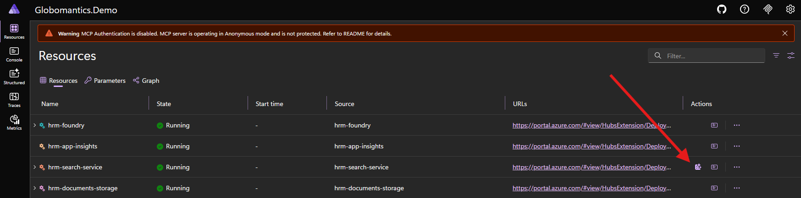

# Full Demo

This is the full course demo project. It uses [Aspire](https://aspire.dev), a cross-platform Infrastructure-as-Code (IaC) local development environment.

<!-- TOC depthfrom:2 depthto:3 -->

- [Prerequisites](#prerequisites)
- [Get Started](#get-started)
- [Using the MCP Inspector](#using-the-mcp-inspector)
- [Connecting to the MCP Server](#connecting-to-the-mcp-server)
    - [Visual Studio Code default](#visual-studio-code-default)
    - [Claude Desktop optional](#claude-desktop-optional)
    - [ChatGPT](#chatgpt)
- [Azure Provisioning optional](#azure-provisioning-optional)
    - [Configure Azure Integration for Aspire](#configure-azure-integration-for-aspire)
    - [Indexing the PDF Documents](#indexing-the-pdf-documents)
    - [Deleting and Cleaning Up Resources](#deleting-and-cleaning-up-resources)
    - [Troubleshooting](#troubleshooting)
- [Protect the MCP Server with Entra ID optional](#protect-the-mcp-server-with-entra-id-optional)
    - [Enabling Authentication](#enabling-authentication)
    - [HRM API Entra App Registration](#hrm-api-entra-app-registration)
    - [MCP Server Entra App Registration](#mcp-server-entra-app-registration)
    - [Provide the Entra Parameters to Aspire](#provide-the-entra-parameters-to-aspire)
    - [Testing the Auth Flow](#testing-the-auth-flow)
    - [Compatibility Issues with MCP Clients and Microsoft Entra](#compatibility-issues-with-mcp-clients-and-microsoft-entra)
    - [Troubleshooting](#troubleshooting)
- [Deploying to Azure optional](#deploying-to-azure-optional)
    - [Preparing the Deployment](#preparing-the-deployment)
    - [Testing with MCP Inspector](#testing-with-mcp-inspector)
    - [Custom Pipeline Deployment Steps](#custom-pipeline-deployment-steps)
    - [Troubleshooting](#troubleshooting)
- [Aspire Architecture](#aspire-architecture)
    - [HRM API](#hrm-api)
    - [MCP Server](#mcp-server)
    - [Azure Blob Storage](#azure-blob-storage)
    - [Azure AI Search](#azure-ai-search)

<!-- /TOC -->

## Prerequisites

- Follow the [Aspire](https://aspire.dev/get-started/prerequisites/) prerequisites guide
- [.NET 8 SDK](https://get.dot.net/8) and the [.NET 10 SDK](https://get.dot.net/10)
- [Azure Functions Core Tools](https://learn.microsoft.com/en-us/azure/azure-functions/functions-run-local)
- [Node.js 22+](https://nodejs.org)
- [Docker Desktop](https://www.docker.com/products/docker-desktop/) or [Podman](https://podman.io)
- _Optional:_ [Azure CLI](https://learn.microsoft.com/en-us/cli/azure/install-azure-cli?view=azure-cli-latest) for Azure integration
- _Recommended:_ [Visual Studio Code](https://code.visualstudio.com)

The Aspire CLI (`aspire`) must be installed and available on the path. You can install using the following scripts.

On Windows:

    iex "& { $(irm https://aspire.dev/install.ps1) }"

On Linux or macOS:

    curl -sSL https://aspire.dev/install.sh | bash

Run the following commands to verify your environment is set up correctly:

```sh
dotnet --list-sdks # Should include 8.x and 10.x
node -v # Should be 22.x or above
npm -v # Should be 10.x or above
aspire --version # Should be 13.1 or above
func -v # Should be 4.6.0 or above
```

## Get Started

In the demo directory, run Aspire:

```sh
aspire run
```

> [!IMPORTANT]
> If this is your first time running an Aspire project, the `aspire run` command will prompt you to **Trust certificates**. On Windows and macOS, you can follow the prompts. These are required for the local development environment to use HTTPS.

If everything is working, you will Aspire print out the service information like this:

```sh

     AppHost:  Globomantics.Demo.AppHost/Globomantics.Demo.AppHost.csproj                 
                                                                                          
   Dashboard:  https://localhost:17006/login?t=unique-code        
                                                                                          
        Logs:  /Users/kamranicus/.aspire/cli/logs/apphost-10541-2026-01-09-16-26-56.log   
                                                            
               Press CTRL+C to stop the apphost and exit. 
```

Follow the **Dashboard** link to view the Aspire dashboard and find your service URLs.

The following Aspire resources should be **Healthy**:

- `mcp` - MCP server project (C#) hosted by default at `http://localhost:5000`
- `hrm-api` - Azure Functions project hosted on `http://localhost:5002`
- `mcp-inspector` - MCP inspector (npx) hosted by default at `http://localhost:6274`
- `mcp-inspector-entra-patcher` - Fixes a known issue with MCP Inspector that makes it incompatible with Entra ID-based OAuth flows
- `hrm-documents-storage` - Azure blob storage (with PDFs pre-baked)

There are more commands you can run:

```sh
# Run a Protected MCP server locally (requires Entra ID)
aspire run --EnableMcpAuth=true

# Run an Anonymous MCP server locally with provisioned Azure resources (AI Search)
aspire run --EnableAzure=true

# Deploy to Azure Container Apps (ACA)
aspire deploy
# Deploy a Protected MCP Server to ACA (requires Entra ID)
aspire deploy --EnableMcpAuth=true

# Clean up all Azure resources
aspire do clean-az
```

These are detailed below in their respective sections.

## Using the MCP Inspector

Aspire has provisioned the MCP Inspector (`mcp-inspector`) resource. Click the **Client** link in the Dashboard to connect to your MCP server!

## Connecting to the MCP Server

In your AI tool MCP configuration, you can follow the guide in the course or in tool documentation. The URL should be `http://localhost:5000`, but you
can view the MCP server URL in the Aspire Dashboard (the `mcp` resource).

### Visual Studio Code (default)

In the `.vscode/mcp.json` configuration, the MCP server is already set up:

```json
{
    "servers": {
        "globomantics-mcp-server-local": {            
            "type": "http",
            "url": "http://localhost:5000/"
        }
    }
}
```

Just click the **Start** command over the MCP server name to start it. Reference the course or [VS Code documentation](https://code.visualstudio.com/docs/copilot/customization/mcp-servers) for how to use with Copilot Agent mode.

### Claude Desktop (optional)

In the course, Claude is used to demo the MCP server for STDIO and Streamable HTTP transport. With authentication disabled, you can configure the MCP server in `claude_desktop_config.json` (Settings -> Developer):

```json
{
    "mcpServers": {
        "globomantics-mcp-server-local": {            
            "type": "http",
            "url": "http://localhost:5000/"
        }
    }
}
```

This is shown step-by-step in the course or you can [reference this guide by MCPBundles](https://www.mcpbundles.com/blog/claude-desktop-mcp#claude-desktop-mcp-config-file-location).

### ChatGPT

> [!IMPORTANT]
> This is only available on the **Web** and on paid plans.

In order to use MCP servers with ChatGPT, you need to enable [Developer Mode](https://platform.openai.com/docs/guides/developer-mode) from the website.

This requires you to deploy your MCP server in **Anonymous Mode**, which you can find how to do in the [Deploying the Project](#deploying-to-azure-optional) section.

> [!IMPORTANT]
> The MCP server must be anonymous. Entra ID is only supported by Visual Studio Code's MCP integration. In the **Advanced** MCP course,
> we introduce an Auth Gateway that makes your OAuth-protected MCP server compatible with all MCP clients.

## Azure Provisioning (optional)

By default, Aspire will not provision any Azure infrastructure and authentication is disabled. This is the easiest way to run the course demos
but some MCP tools that require Azure authentication, like `ask_about_policy` will be disabled. The rest will work locally!

You can optionally enable Azure provisioning to try out Azure AI Search or deploy the entire project remotely to run on Azure Container Apps (ACA). This is Azure's managed Kubernetes environment.

> [!NOTE]
> Learn more about [how Aspire apps are deployed to Azure](https://aspire.dev/deployment/azure/aca-deployment-aspire-cli/). This feature is still in preview.

### Configure Azure Integration for Aspire

> [!IMPORTANT]
> The [Azure CLI](https://learn.microsoft.com/en-us/cli/azure/install-azure-cli?view=azure-cli-latest) is required for Azure integration in Aspire. Follow the installation guide before continuing.

First, begin by logging into the Azure CLI:

```sh
az login
```

This will trigger a login flow and afterwards it will ask you to select your subscription. Choose the Azure subscription you want to deploy resources in and note its `SubscriptionId`.

> [!TIP]
> You can also query your subscription ID with `az account show --query id`

Then, add the following Azure subscription secrets:

```sh
dotnet user-secrets set "Azure:SubscriptionId" "your-subscription-id" --project ./Globomantics.Demo.AppHost
dotnet user-secrets set "Azure:Location" "eastus" --project ./Globomantics.Demo.AppHost
dotnet user-secrets set "Azure:CredentialSource" "AzureCli" --project ./Globomantics.Demo.AppHost
```

Now run Aspire with the `EnableAzure=true` flag turned on:

```sh
aspire run --EnableAzure=true
```

When the flag is enabled, Aspire will provision the following resources in Azure:

- `hrm-search-service` - Azure AI Search Service
- `hrm-foundry` - Azure AI Foundry
- `hrm-embeddings` - Foundry-deployed OpenAI model for text-embedding-ada-002

> [!TIP]
> You can also set `EnableAzure` to `true` in the `Globomantics.Demo.AppHost/appsettings.json` file.
> This will apply to all `aspire run`, `aspire deploy`, and `aspire do` commands.

### Indexing the PDF Documents

The first time you run the Aspire project with Azure provisioning, an AI search index is created but the PDF documents will not actually be _indexed_ yet. If you try to run the `ask_about_policy` tool, you will not see any document excerpt until you index the PDF documents in the vector database.

To index the PDFs, in the Aspire dashboard, click the **Run Search Indexer** command button next to the `hrm-search-service` to index the documents.



It will take a few seconds before the indexing operation runs. You can view the logs using the Console Logs screen in the Dashboard, or
view the Search Indexer in the Azure portal for details.

> [!NOTE]
> This operation will cost a few cents as it issues requests to the embedding model deployment to index the documents.

### Deleting and Cleaning Up Resources

Aspire does not automatically teardown your provisioned Azure resources. While every effort has been made to use the Free SKUs for each resource, there may still be costs associated with keeping the resources provisioned.

#### Run Cleanup Task

To delete all the resources Aspire provisions in Azure, run the following command:

```sh
# Delete all Aspire-related Azure resources (requires confirmation)
aspire do clean-az

# Skip confirmation prompts
aspire do clean-az -y
aspire do clean-az --yes
```

> [!NOTE]
> By default, you will be asked to confirm before it will delete any Azure resources. 
> 
> **Be advised:** If you pass the `-y/--yes` CLI flag, it skips confirmation prompts.

This command will:

1. Search for any resource groups in your subscription tagged with `aspire: true` 
1. Delete any if found
1. Find any soft-deleted AI Foundry tagged with `aspire-resource-name: <AI foundry resource name>`
1. Purge them, if found
1. Clear deployment state of `Azure:Deployment:*` and `Azure:ResourceGroup` keys for `aspire deploy`
1. Clear user secrets of `Azure:Deployment:*` and `Azure:ResourceGroup` keys for `aspire run`

> [!TIP]
> This is super useful if you need to setup/teardown frequently or just want to clean up all the resources
> when you're done playing around with the demo.

> [!IMPORTANT]
> When running `aspire do clean-az`, you don't need to pass `--EnableAzure=true` as that is implied.

If you live in fear, you can do the steps manually with the `az` CLI -- but it will take longer!

#### Manual Steps: Deleting Resources

First, find the resource groups tagged `aspire: true`:

```sh
rg=$(az group list --query "[?tags.aspire=='true'].{name: name}" -o tsv)
az group delete --name $rg --yes --no-wait
```

Then, find and purge all soft-deleted Foundry resources that match the expected Aspire resource name:

```sh
foundry=$(az cognitiveservices account list-deleted --query "[?tags.\"aspire-resource-name\"=='hrm-foundry'].id" -o tsv)
az resources delete --ids $foundry
```

> [!WARNING]
> The Azure AI Foundry resource will only be _soft-deleted_ when you delete the resource group. Azure keeps it around for a few days before purging it. Trying to re-run `aspire run` or `aspire deploy` will throw an error when provisioning the `hrm-foundry` resource if you don't purge it.

> [!TIP]
> In PowerShell, the `--query` argument [has weird quote problems](https://learn.microsoft.com/en-us/cli/azure/use-azure-cli-successfully-powershell?view=azure-cli-latest&tabs=read%2Cwin2%2CBash2#pass-spaces-in-azure-cli-parameters). Try this:
> 
>     az cognitiveservices account list-deleted --query '[?tags.\""aspire-resource-name\""==''hrm-foundry''].id' -o tsv

#### Manual Steps: Clearing Azure Deployment State

> [!CAUTION]
> If you delete the Azure resource group, `aspire run` will not re-provision resources automatically but they will still appear "Healthy." You will need to **clear the user secrets** of all Azure deployment-related keys in order to re-provision Azure resources during `aspire run`.

.NET user secrets are [stored in different locations](https://learn.microsoft.com/en-us/aspnet/core/security/app-secrets?view=aspnetcore-10.0&tabs=windows#how-the-secret-manager-tool-works) depending on your platform in a `secrets.json` file which you can edit and clear.

On Windows:

    %APPDATA%\Microsoft\UserSecrets\44640097-33da-43a5-bd11-908901a6fa5a\secrets.json

On Linux/MacOS:

    ~/.microsoft/usersecrets/44640097-33da-43a5-bd11-908901a6fa5a/secrets.json

The user secrets ID is in the `Globomantics.Demo.AppHost\Globomantics.Demo.AppHost.csproj` under the `UserSecretsId` property.

> [!TIP]
> If you are using Visual Studio Code with the C# DevKit extension, right-click the `Globomantics.Demo.AppHost\Globomantics.Demo.AppHost.csproj` file in the file explorer and click **Manage User Secrets** which will open the JSON file in the editor directly.

Delete the following keys:

- `Azure:Deployments:*` -- These store metadata about the provisioned resources
- `Azure:ResourceGroup` -- This is the provisioned resource group name

> [!NOTE]
> You could also use `dotnet user-secrets clear` command but this will clear ALL secrets, including the Azure subcription secrets. You will need to re-add the secrets if you do this.

### Troubleshooting

#### The access token is from the wrong issuer

If you receive an error during provisioning like this:

> The access token is from the wrong issuer 'https://sts.windows.net/actual_tenant_id/'. It must match the tenant 'https://sts.windows.net/expected_tenant_id/' associated with this subscription. Please use the authority (URL) 'https://login.windows.net/expected_tenant_id' to get the token. Note, if the subscription is transferred to another tenant there is no impact to the services, but information about new tenant could take time to propagate (up to an hour). If you just transferred your subscription and see this error message, please try back later.

This likely means the Azure Credential Source is not coming from the `az` CLI but somewhere else such as Visual Studio.

Make sure to set the `Azure:CredentialSource` to `AzureCli` (shown above) to explicitly select the Azure CLI as the credential source for `aspire run`.

#### Authentication failed against tenant

During `az login` if you receive the following error:

> Authentication failed against tenant TENANT_ID 'YOUR NAME': SubError: basic_action V2Error: invalid_grant AADSTS50076: Due to a configuration change made by your administrator, or because you moved to a new location, you must use multi-factor authentication to access 'SUBCRIPTION'. If you need to access subscriptions in the following tenants, please use `az login --tenant TENANT_ID`.

You will need to the following the instructions to run `az login` with your specific Entra Tenant ID:

```sh
az login --tenant TENANT_ID
```

The tenant ID is printed out at the beginning of the error message. This error may be due to having multiple tenants or multiple subscriptions with different auth configurations.

#### hrm-search-service: Operation would exceed 'free' tier service quota.

The `hrm-search-service` resource may fail to provision with this error:

> Operation would exceed 'free' tier service quota. You are using 1 out of 1 'free' tier service quota.

This means you already have a Free tier AI Search Service in your Azure Subscription. You will need to remove it before trying to provision, or you will need to modify the `Sku`
to be `Standard` in the Aspire configuration, located in `Globomantics.Demo.AppHost\Azure\AppHostAzureResourceExtensions.cs`:

```diff
var aiSearch = builder.AddAzureSearch("hrm-search-service")
            .WithRunIndexerCommand(azureCredential)
            .ConfigureInfrastructure(infra =>
            {
                var searchService = infra.GetProvisionableResources()
                                    .OfType<SearchService>()
                                    .Single();

                // Keep it affordable for demo purposes
-                searchService.SearchSkuName = SearchServiceSkuName.Free;
+                searchService.SearchSkuName = SearchServiceSkuName.Standard;
```

> [!CAUTION]
> Be advised the Standard SKU for AI Search Service is around $75/mo.

#### hrm-foundry: Deployment failed: FlagMustBeSetForRestore

When using `aspire run` or `aspire deploy` with an Azure subscription set, you may receive the following error:

> Failed to provision hrm-foundry: Deployment failed: FlagMustBeSetForRestore: An existing resource with ID 'resourceId' has been soft-deleted. To restore the resource, 
> you must specify 'restore' to be 'true' in the property. If you don't want to restore existing resource, please purge it first.

This means you [deleted the AI Foundry resource](#deleting-and-cleaning-up-resources) but forgot to _purge_ it. Follow the steps in that section
to ensure the AI Foundry resource is purged before re-running Aspire.

## Protect the MCP Server with Entra ID (optional)

The course features a protected MCP server via OAuth using Microsoft Entra ID as the Authorization Server (AS), also called an Identity Provider (IdP).
In the past, Entra ID was named Azure AD, which is why you may see the abbreviation "AAD" in code and configuration.

Every Azure subscription comes with a default Entra ID "tenant". A tenant is an Active Directory tenant, basically just a way to logically group and separate
identities -- such as organizations, school vs. work vs. personal, etc. You can choose to use your default tenant for protecting the MCP server,
or you can create a new one to keep the demo separate.

At a high-level, you will need to set up your Entra tenant to allow for two APIs: the HRM backend and the MCP server itself, and you will need to configure them
so the MCP server can delegate on-behalf-of the calling user to the HRM API.

> [!IMPORTANT]
> This is the most advanced mode you can operate in and requires manual steps to configure Microsoft Entra.
> This mode also requires you to follow the [Azure Provisioning](#azure-provisioning-optional) steps beforehand.

At the end of this process, you will have several identifiers to add as parameters in Aspire:

- `hrmApiAadClientId` -- This is the Entra "Client ID" (or Application ID) which identifies the HRM backend app registration
- `hrmApiAadClientSecret` -- This is the Entra "Client Secret" which is used to sign and secure cookies for the Azure App Service "Easy Auth" configuration
- `mcpServerAadClientId` -- This is the Entra "Client ID" (or Application ID) which identifies the MCP server app registration
- `mcpServerAadClientSecret` -- This is the Entra "Client Secret" which is used to exchange tokens on-behalf-of the the calling user through OAuth delegation

### Enabling Authentication

You can run with OAuth protection enabled using the `EnableMcpAuth` flag:

```sh
aspire run --EnableMcpAuth=true
```

> [!TIP]
> You can also set `EnableMcpAuth` to `true` in the `Globomantics.Demo.AppHost/appsettings.json` file.
> This will apply to all `aspire run`, `aspire deploy`, and `aspire do` commands.

Before you do though, you'll need to set up extra configuration.

First, find your Azure tenant ID:

```sh
az account show --query tenantId
```

> [!NOTE]
> This is your Entra tenant "issuer" that will issue and sign the authentication tokens.

Add a new user secret (or provide it in the Aspire dashboard):

```sh
dotnet user-secrets set "Parameters:azureTenantId" "your-tenant-id" --project ./Globomantics.Demo.AppHost
```

You will also need to configure two Microsoft Entra app registrations.

### HRM API Entra App Registration

The HRM API backend is deployed using Azure Functions and is protected by Microsoft Entra ID. The MCP server
calls this downstream API on-behalf-of the user. 

To support this, the app registration requires a client secret credential to be created, as well as a 
delegated API permission scope.

**Steps**

1. Create an **App Registration** for the HRM API
    - Be sure to copy the **App (Client) ID** for the `hrmApiAadClientId` parameter
1. Under **Authentication**, and the **Settings** tab, ensure `ID tokens` is checked under implicit grant flow
1. Under **Expose an API**, add **A new scope** with the following values:
      - **Name:** user_impersonation
      - **Who can consent?**: Admins and users
      - **Admin consent display name:** Delegated access to the HRM API
      - **Admin consent description:** Allow the application to access the HRM API on behalf of the signed-in user.
      - **User consent display name:** Access the HRM API
      - **User consent description:** Allow the application to access the HRM API on your behalf
      - Once created, it will look like `api://{hrmApiAadClientId}/user_impersonation`
1. Under **Certificates & Secrets**, add a **Client Secret**
    - Be sure to copy the secret to provide for the `hrmApiAadClientSecret` parameter

### MCP Server Entra App Registration

The MCP server will also be protected by Entra ID, via the native OAuth middleware in the MCP C# SDK. This requires
another separate app registration with a client secret credential. Since some clients will connect via OAuth flows
from the browser, you will also need to configure Redirect URIs.

**Steps**

1. Create an **App Registration** for the MCP server
    - Be sure to copy the **Application ID** for the `mcpServerAadClientId` parameter
1. Under **Authentication**, add the following **Single-page Application** Redirect URIs:
    - `http://localhost:6274/oauth/callback/debug`
    - `http://localhost:6274/oauth/callback`
    - These are to support the MCP Inspector OAuth flow
1. Under **API Permissions**, add the following scope:
    - **Name:** mcp
    - **Who can consent?**: Admins and users
    - **Admin consent display name:** Access MCP server
    - **Admin consent description:** Access MCP server tools, prompts, and resources
    - **User consent display name:** Grant access to MCP server
    - **User consent description:** Allow MCP server to access your basic user data
    - Once created, it will look like `api://{mcpServerAadClientId}/mcp`
1. Under **Certificates and Secrets**, add a **New Client Secret**
    - Be sure to copy the secret for the `mcpServerAadClientSecret` parameter
1. Add a delegated API permission scope following the steps below

#### Configuring App Delegation / Impersonation

Follow the steps below to configure the MCP client to support the OBO (On-Behalf-Of) OAuth flow:

1. Under **API Permissions**, click **Add a permission**.
1. In the "Request API Permissions" drawer, select the **My APIs** tab.
1. Select the HRM app registration you created earlier.
1. Under "What type of permissions?" select **Delegated permissions**.
1. Select the `user_impersonation` scope you created earlier.
1. Click "Add Permissions"

> [!IMPORTANT]
> Make sure your account owns both the MCP server and HRM API app registrations.
> Otherwise, the HRM API’s `user_impersonation` delegated permission won’t appear here. 
> You can double-check this under the **Owners** section in the app registration.

Once you select the scope and add the permission, it will show up under the **API Permissions** list.

### Provide the Entra Parameters to Aspire

You can manually set the user secrets using the `dotnet user-secrets` tool, or you can run Aspire:

```sh
aspire run --EnableMcpAuth=true
```

When you visit the Dashboard, at the top you will be asked to fill in some missing parameter values.
These are the client IDs and secrets you just created.

Once entered, Aspire will proceed to configure authentication for the `mcp` server and `hrm-api` backend.

### Testing the Auth Flow

When running locally with `aspire run`, authentication will now be enabled.

You can test the auth flow using the MCP inspector as shown in the course, by opening it
and going to the Auth section and using the Guided OAuth Flow screen.

> [!IMPORTANT]
> Azure Functions does **not** formerly support authentication when run locally, so a development middleware is used
> to simulate the HTTP headers that Azure App Service Authentication provides. Under the hood, it
> relies on Azure Identity and your Az CLI credentials to map your credential to the test users.

The `plan_time_off` tool will return your current authenticated user information. You can also use
the Swagger UI for the HRM API to call the `getAuthenticatedUserIdRaaS` API and view the response.

### Compatibility Issues with MCP Clients and Microsoft Entra

In **Protected Mode**, the MCP server will be protected by Microsoft Entra as the identity provider. Unfortunately, Microsoft Entra has some incompatibilities with most MCP clients:

- It does not yet support Dynamic Client Registration (DCR)
- It does not yet support Client-issued Metadata Documents (CIMD)
- It does not support the `resource` parameter during authorization code flows (SEP-835)

As a result, Microsoft Entra by itself cannot be used for most MCP clients except for Visual Studio Code. 
For all other MCP clients, your protected MCP server **will not be compatible.**

> [!NOTE]
> For the MCP Inspector specifically, you can make it compatible with a [patch](patches/). See this [discussion](https://github.com/modelcontextprotocol/inspector/issues/685) for details. The Aspire project does this automatically for you with the `mcp-inspector-entra-patch` resource.

To support other MCP clients, see the [Advanced MCP course](https://github.com/kamranayub/pluralsight-course-mcp-advanced) where we introduce an MCP Authentication Gateway. This federates authentication so that Microsoft Entra is no longer the front door for MCP clients, adds DCR support, and supports session-based token storage. This is also **more secure** as the MCP clients never see Entra ID authentication tokens and instead only are provided session-based "reference" tokens.

### Troubleshooting

#### The redirect URI specified in the request does not match

When signing in from the MCP Inspector to the MCP server through the OAuth flow, you may receive the following error from Microsoft Entra:

> AADSTS50011: The redirect URI 'http://localhost:6274/oauth/callback/debug' specified in the request does not match the redirect URIs configured for the application 'client_id'.

The problem is that you do not have the MCP Inspector OAuth callback added as a Redirect URI in the Entra app registration for the MCP server.

Revisit the configuration steps above to ensure you've added the redirect URI under the "Single-page Application" Redirect URIs.

## Deploying to Azure (optional)

The Aspire project supports deploying to Azure and provisioning Azure Container Apps (ACA) for the MCP server and HRM backend API. It will also provision all the supporting resources, including Azure Storage, Azure AI Foundry, and Azure AI Search.

The project supports deploying to Microsoft Azure in two modes:

- **Anonymous:** In this mode, the MCP server is anonymous and publicly accessible but you don't need Entra ID set up.
- **Protected:** In this mode, the MCP server is protected by Entra ID but requires additional configuration.

The **Anonymous** mode is when you run with the `--EnableMcpAuth=false` flag (the default). This mode is useful if you just want to play with
the MCP server, but you should immediately clean it up after you're done or anonymous users could issue requests to the MCP server.

The **Protected** mode is when you run with the `--EnableMcpAuth=true` flag. This mode is the most robust and showcases how
you can protect a MCP server in production. However, it is also the **most complex** to set up. You must complete the prerequisite steps
in the [Entra ID Setup](#enabling-authentication) section first before deploying in this mode. 

> [!TIP]
> Test Protected mode locally using `aspire run` before trying to use `aspire deploy`. If it works locally,
> it has a higher chance of "just working" when deployed.

### Preparing the Deployment

To prepare for a production deployment, you must [delete any existing resources in Azure](#deleting-and-cleaning-up-resources).

> [!IMPORTANT]
> If you have previously ran `aspire run` with an Azure subscription set, it will have provisioned an AI Search Service (`hrm-search-service`) in the
> Free SKU tier. If you try to run `aspire deploy` _without_ deleting the existing resource, it will fail to provision because you can only have 1 Free Tier SKU
> in your subscription.
>
> **TODO:** It may be possible to detect existing AI Foundry and AI Search service resources and reuse them for deployment.

Once the existing resources have been cleaned up, run the Aspire deployment command:

```sh
aspire deploy
```

> [!IMPORTANT]
> When running `aspire deploy`, you don't need to pass `--EnableAzure=true` as that is implied.

**If you are deploying in Protected mode,** Aspire will ask you to provide the Entra secrets and configuration parameters:

```sh
❯ aspire deploy
(pipeline-execution) → Starting pipeline-execution...
(process-parameters) → Starting process-parameters...
Please provide values for the unresolved parameters.
```

Enter the values you previously did when using authentication with `aspire run`.

Aspire will begin the deployment and ask you to select your Azure tenant:

```sh
(fetch-tenant) → Starting fetch-tenant...
(fetch-tenant) → Fetching available tenants
(fetch-tenant) ✓ Fetching available tenants (2.4s)
(fetch-tenant) ✓ Found 1 available tenant(s)
Select your Azure tenant:                                             
```

Select the Tenant ID you want to deploy to (this should match the expected Entra ID tenant you will authenticate with).

Next, Aspire will ask you to select your Azure subscription:

```sh
(fetch-subscription) → Starting fetch-subscription...
(fetch-subscription) → Fetching available subscriptions
(fetch-subscription) ✓ Fetching available subscriptions (1.4s)
(fetch-subscription) ✓ Found 1 available subscription(s)
Select your Azure subscription: 
```

Select the Azure subscription you've been using or a new one to deploy live resources to.

Next, Aspire will ask you to select a resource group or enter a new name:

```sh
(fetch-resource-groups) → Starting fetch-resource-groups...
(fetch-resource-groups) → Fetching resource groups
(fetch-resource-groups) ✓ Fetching resource groups (1.6s)
(fetch-resource-groups) ✓ Found 35 resource group(s)
Select your Azure resource group or enter a new name:
```

Scroll down using the arrow keys to select an existing group, or scroll all the way to the bottom and select **Other** to create a new one.

Press 'Enter' to select the default generated resource group name or enter your own custom name.

Next, Aspire will ask you to select a region.

> [!IMPORTANT]
> You must select a region where Azure AI Search and Foundry can deploy models. `eastus` is the default region the demo assumes.

Once you select a region, Aspire will begin the deployment and this can take a few minutes to complete.

The pipeline logs will display the Aspire Dashboard and MCP server URLs like this:

```sh
(print-dashboard-url-aca-env) ✓ Dashboard available at
https://aspire-dashboard.ext.<ENVIRONMENT>.<LOCATION>.eastus.azurecontainerapps.io

(print-mcp-summary) i [INF] Successfully deployed mcp to
https://mcp.<ENVIRONMENT>.<LOCATION>.azurecontainerapps.io
```

#### Testing Sign-in Flow

Once deployed, try visiting the `hrm-api` ingress URL in your browser. You should be redirected to the Microsoft Login flow.
If you're signed in, you'll be redirected back and be greeted with a "Your Functions App Has Been Deployed" page.

> [!IMPORTANT]
>  _Revision_ ingress URLs are not automatically added as Web Redirect URIs in Entra. Only the primary ingress URL.


### Testing with MCP Inspector

When using `aspire deploy`, the MCP Inspector will _not_ be provisioned or started as part of your Aspire deployment.

You can start the Inspector manually by running `npm run inspect` in the AppHost directory:

```sh
cd Globomantics.Demo.AppHost
npm run inspect
```

Once it launches your browser, connect to the MCP server ingress URL displayed in the pipeline log to test out the MCP server.

> [!NOTE]
> The URL may use the previous `http://localhost:5000` URL you've been testing, if you previously ran `aspire run`.

> [!IMPORTANT]
> If deployed in **Protected Mode**, you can go through the Guided OAuth Flow to test out the authentication.
> Be sure to use the static MCP server client ID, since Microsoft Entra does not support Dynamic Client Registration (DCR).

### Custom Pipeline Deployment Steps

The `aspire deploy` pipeline [can be customized](https://aspire.dev/get-started/pipelines/) to perform custom application-specific steps. These
steps help set up and configure the Azure environment so that the MCP server and HRM backend API
work properly without any extra manual configuration.

These steps are run automatically when you run `aspire deploy`, but you can also execute them
manually using `aspire do <step name>`.

> [!NOTE]
> Much of this automation also executes when you do `aspire run`, but pipeline steps are customized
> for the deployment process which can vary slightly.

#### `update-hrm-api-microsoft-auth`

In **Protected Mode**, the HRM API backend will be protected using [Azure App Service Authentication for Container Apps](https://learn.microsoft.com/en-us/azure/container-apps/authentication#secure-endpoints-with-easyauth).

This step will:

1. Configure `hrm-api` Container App with Entra authentication
  - Uses `az containerapp auth microsoft update` command
1. Add the ingress URL as a "Web" Redirect URI to your Entra app registration
  - Uses `az ad app update` command

#### `update-mcp-cors-policy`

In **Protected Mode**, this step will run `az ingress cors enable` to add a CORS policy to allow
the MCP inspector URL (`http://localhost:6274`). This is to allow for OAuth flows to work when
using the MCP inspector, otherwise you will receive CORS errors.

#### `provision-hrm-search-service-roles-hrm-foundry`

This step assigns the `hrm-search-service` managed identity the **Cognitive Services OpenAI User** role on the `hrm-foundry`
resource. This is required for Azure AI Search to issue requests to the text embedding model deployment.

#### `provision-hrm-search-service-roles-hrm-document-storage`

This step assigns the `hrm-search-service` managed identity the **Storage Blob Data Reader** role on the `hrm-document-storage`
resource. This is so that the Azure AI Search _Indexer_ can index the PDF documents.

#### `provision-hrm-search-service-indexer`

In the course, in order to mitigate hallucination and provide more accurate policy information, there's a demo of
using Azure AI Search with a RAG vector index. This is used by the `ask_about_policy` tool under-the-hood.

This step does all the heavy lifting to create a [search indexing pipeline](https://learn.microsoft.com/en-us/azure/search/tutorial-skillset) in the Azure AI Search service:

1. A data source that uses `hrm-document-storage` blob container to find the PDFs
1. A skillset that supports splitting text into chunks with vector embeddings using the `hrm-foundry` model deployment
1. A search index that supports vector embeddings and automatic query text vectorization
1. A [search _indexer_](https://learn.microsoft.com/en-us/azure/search/search-how-to-create-indexers) which is a background task that actually performs the PDF document indexing operation

The search indexer automatically runs as part of the deployment process. 

> [!IMPORTANT]
> Running the search indexer is required for the `ask_about_policy` tool to work, otherwise
> you will not receive any document excerpts back from Azure AI Search.

#### `upload-hrm-pdf-documents`

This step will automatically upload all the PDF documents in the `Globomantics.Demo.AppHost/documents` folder to the
provisioned Azure Storage blob container.

This is to enable the Azure AI Search indexer to index the documents into the vector database.

### Troubleshooting

#### Deployment fails after deleting production resources

Aspire stores deployment state separately when using `aspire deploy` then it does when using `aspire run`.

When you run `aspire deploy`, it should print out a message like this:

```sh
(deploy-prereq) i [INF] Deployment state will be loaded from: /a/long/path/to/production.json
```

That file is what stores the _deployment_ secrets. You need to perform [the same cleanup](#deleting-and-cleaning-up-resources) where you delete all `Azure:Deployments:*` keys from the file.

This will force Aspire to re-provision the resources from scratch.

## Aspire Architecture

### HRM API

#### Overview
- Implemented as Azure Functions (C# .NET) exposing a small HRM-compatible HTTP API.
- Uses OpenAPI attributes to annotate operations, parameters and responses so the function app can produce API documentation and client metadata.
- Lightweight, serverless design intended for demo / test usage backed by an in-memory MockDataStore.

#### Authentication & identity
- Azure Functions App has "EasyAuth" enabled, which injects authenticted user principal in HTTP headers.
- Daemon aka S2S auth flow presents `Bearer` token in `Authorization` header for EasyAuth to authenticate (application-only authentication).
- Native app aka OBO (On-Behalf-Of) flow requires MCP client to authenticate and MCP server to forward credetials for impersonation (delegated access).
- The functions read claims from the incoming HttpRequest headers to identify the caller.
- The code extracts an email claim from the parsed ClaimsPrincipal and maps it to an Employee ID via the mock store. Missing/invalid authentication returns 401.

#### Data & persistence
- Current implementation uses a MockDataStore in memory (Workers, AbsenceTypes, BenefitPlans, TimeOffRequests).
- Time off requests are appended in-memory and assigned a GUID for demonstration.
- Production guidance: replace MockDataStore with durable persistence (database, blob or managed service), and avoid in-memory state across function instances.

#### Notes
- The API follows conventional RESTful structure for resource paths and HTTP verbs but embeds specific query conventions (e.g., Worker!Employee_ID and fixed category usage) to match the HRM integration surface.

### MCP Server

- The MCP server when run **locally** uses S2S (system identity) auth to talk to the HRM API and AI Search Service. This is the end-state of M3.
- The MCP server when run **remotely** uses OBO delegated auth. It is hosted on Azure Functions using the MCP Handler customization (and not the MCP Handler extension preview). This is the end-state of M4.

### Azure Blob Storage

The `sthrmdocs` Azure storage account contains a `globomanticshrm` Blob container. This container keeps several PDFs (found in repo). Each blob has metadata:

- **Description:** A brief LLM-friendly description of the document.
- **Category:** A `PlanDocumentCategory` string enum value (defined in MCP Server `HrmDocumentService` model).

The `Category` metadata is used to correlate a benefit document with benefit plan data from the HRM API. This is specific to the MCP server design.

### Azure AI Search

The search service exposes a search index that indexes the PDF documents for RAG vector search. It uses an embedding model and supports querying by text.